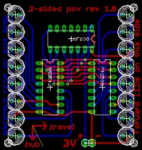
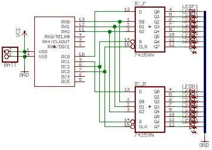

In 2005 I spent a few months playing around with a persistence of vision (POV)
circuit for a bike wheel. It was my first foray into electronics and
micro-controllers so, while it worked, it was a hack.

The project was [linked to by hack a day](http://www.hackaday.com/entry/1234000777036590/)
which was my 15 minutes of internet fame.



I based the project on two of [Lady Ada](http://www.ladyada.net/index.html)'s
POV projects, the [MiniPOV](http://www.ladyada.net/make/minipov/index.html) and
[Spoke POV](http://www.ladyada.net/portfolio/2003/index.html). The MiniPOV uses
only a single PIC16F630 while the spoke uses an Amtel micro-controller, an
EEPROM, and several 74x259 8-bit latches.



I wanted to enhance the MiniPOV to display text on both sides of the bike wheel.
I chose to use Microchip's PIC because they sold a cheap programmer and I had
Lady Ada's working source code. the biggest challenge with displaying text on
both sides of the wheel each side needs to read from a different end of the
string. if you're displaying ABC the left side needs to start at C and the
right side needs to start at A. that meant I needed 16 outputs, four more than
the 16F630 has. To work around this I used an 8-bit addressable latch for each
side.

The MiniPOV project uses a simple bitmap to determine what to output. I wanted
to have separate bitmaps for each character and link them together in a string.
I started by modifying the MiniPOV to use two jump tables. the first selected
the character from the string, and the second returned individual lines in the
character. Once that was working I started trying to figure out how to read it
in reverse order. I wasn't able to think of anything cleaver so I decided to
throw memory at it and just duplicated the code with the order reversed.

I went through a hell of a time finding the proper LEDs for this. trying to
find bright LEDs that had a wide viewing angle and didn't cost a buck each was
hard. I probably ordered ten different kinds from digikey. the ones below are
1500 mcd with a 70&deg; by 40&deg; viewing angle and only cost about 30 cents
each.

### Parts list

<table>
<tr>
  <th>Description</th> <th>Quantity</th> <th>Supplier</th> <th>Part number</th>
</tr>
<tr>
  <td>PCB board</td> <td>1</td> <td><a href="http://www.barebonespcb.com/">advanced circuits</a></td> <td>custom order</td>
</tr>
<tr>
  <td>PIC16F630 8-bit PIC microcontroller</td> <td>1</td> <td><a href="http://digikey.com/">digikey</a></td> <td><a href="http://www.digikey.com/scripts/DkSearch/dksus.dll?PName?Name=PIC16F630-I/P-ND">PIC16F630-I/P-ND</a></td>
</tr>
<tr>
  <td>14-pin IC socket</td> <td>1</td> <td><a href="http://digikey.com/">digikey</a></td> <td><a href="http://www.digikey.com/scripts/DkSearch/dksus.dll?PName?Name=AE7214-ND">AE7214-ND</a></td>
</tr>
<tr>
  <td>74HC259 8-bit addressable latch</td> <td>2</td> <td><a href="http://digikey.com/">digikey</a></td> <td><a href="http://www.digikey.com/scripts/DkSearch/dksus.dll?PName?Name=296-8291-5-ND">296-8291-5-ND</a></td>
</tr>
<tr>
  <td>high brightness LEDs</td> <td>16</td> <td><a href="http://digikey.com/">digikey</a></td> <td><a href="http://www.digikey.com/scripts/DkSearch/dksus.dll?PName?Name=160-1620-ND">160-1620-ND</a></td>
</tr>
<tr>
  <td>3 volt lithium battery with soldering tabs</td> <td>1</td> <td><a href="http://digikey.com/">digikey</a></td> <td><a href="http://www.digikey.com/scripts/DkSearch/dksus.dll?PName?Name=P201-ND">P201-ND</a></td>
</tr>
<tr>
  <td>SPDT slide switch</td> <td>1</td> <td><a href="http://digikey.com/">digikey</a></td> <td><a href="http://www.digikey.com/scripts/DkSearch/dksus.dll?PName?Name=EG1901-ND">EG1901-ND</a></td>
</tr>
</table>

### Software
The PIC assembly code is attached below. To assemble it you'll need Microchip's
[mplab IDE](http://www.microchip.com/pagehandler/en-us/family/mplabx/) or the
[gnu PIC tools](http://gputils.sourceforge.net/). Then you'll need something to
program the PIC with. I spent the $30 for Microchip's [PICkit 1 flash starter kit](http://www.microchip.com/stellent/idcplg?IdcService=SS_GET_PAGE&nodeId=1406&dDocName=en010053).

### Hardware
The board layout was done using CadSoft's freeware version of [EAGLE](http://www.cadsoft.de/info.htm).
you can download the board and schematic files below.

 

### Future improvments
This is the first board I'd ever designed so I made plenty of mistakes:

- I didn't label the board with orientation information (I've corrected this in
  the version posted here).
- I forgot to put resistors inline with the LEDs. This hasn't been as big a
  problem as I would have thought because they're being pulsed and because
  cooling isn't a problem.
- I didn't put a switch on the board forcing me to put it inline on the power
  cable.

In the next revision I've got several things I'm looking at changing:

- putting a momentary contact switch on the board and having it put the pic
  into sleep mode.
- adding a hall effect sensor and magnet to determine the speed of the wheel
  ala <a href="http://www.ladyada.net/portfolio/2003/index.html">the spoke
  project</a>.
- moving to a higher end pic with more flash space or using an external flash
  rom chip.

### Downloads

- [minipov.asm](minipov.asm)
- [2-sided_pov.brd](2-sided_pov.brd)
- [2-sided_pov.sch](2-sided_pov.sch)
