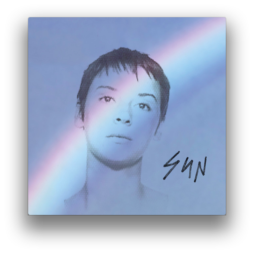
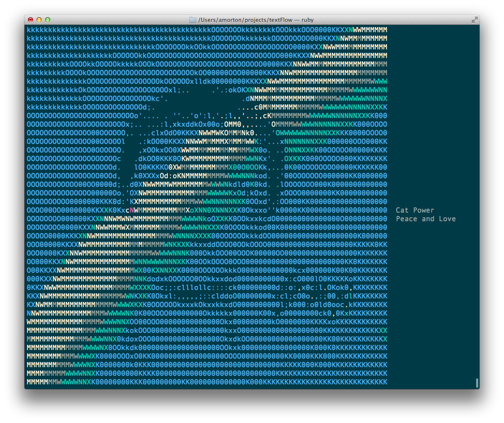

I had an old H19 Heathkit terminal that I wanted to do something fun with and
I was looking for an excuse to learn some Ruby so I decided to write a program
to display the iTunes artwork as ASCII text.

### Original

### Result

The program uses AppleScript to communicate with iTunes and extract the album
art. Since the images can be in many different formats it uses ImageMagic to
convert them to JPEGs which are piped into jp2a. Depending on what the terminal
supports, jp2a will either convert it to monochrome ASCII or colorized ANSI
text. The song's art and metadata are positioned on the screen using the curses
library.

[See the code on GitHub](https://github.com/drewish/textflow)